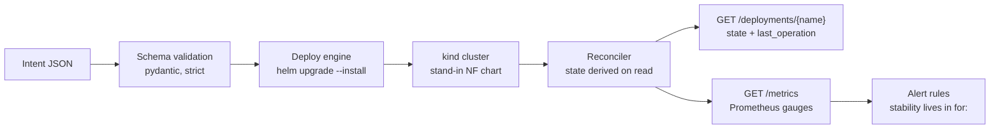

# nf-orchestrator

[](https://github.com/poggymacello/nf-orchestrator/actions/workflows/ci.yaml)

Takes a declarative intent, validates it, deploys a network function with Helm onto Kubernetes, and
reports its lifecycle state from live cluster signals — plus eight failure drills that each proved
the reporting wrong, and the fixes that followed.

This is a **self-directed learning project**: a generic re-implementation, built only from public
sources, of the pattern behind SMO-driven network function orchestration in O-RAN. It runs on one
laptop against one `kind` cluster. It is not a production O-Cloud, and the deployed workload is a
generic stand-in NF, not vendor software. Full scope and non-goals in
[`docs/design/00-overview.md`](docs/design/00-overview.md).

## What it does



Every deployment reports one of four lifecycle states — `NOT_INSTANTIATED`, `INSTANTIATING`,
`INSTANTIATED`, `FAILED` — derived from Helm release status and live pod readiness on each read,
never stored. What happened to the last *operation* is reported separately, because a rejected
upgrade is not a broken network function. The model, and its grounding in ETSI SOL003 and O-RAN's
O2 interface, is in [`docs/design/lifecycle-states.md`](docs/design/lifecycle-states.md).

## Quickstart

Needs Docker, [kind](https://kind.sigs.k8s.io/), kubectl and **Helm 4**.

```bash
make install && make up
uvicorn orchestrator:app --port 8000
```

Then, in another shell — this is real output, not an illustration:

```
$ curl -s -X POST localhost:8000/deployments -H 'content-type: application/json' \
    -d '{"name":"sample-nf","replicas":2,"environment":"dev"}'
{"release":"sample-nf","status":"deployed","revision":1,
 "values":{"replicaCount":2,"environment":"dev"}}

$ curl -s localhost:8000/deployments/sample-nf          # a second later
{"release":"sample-nf","state":"INSTANTIATING","helm_status":"deployed",
 "desired_replicas":2,"ready_replicas":0,
 "last_operation":{"revision":1,"state":"COMPLETED","description":"Install complete"},
 "pods":[{"phase":"Pending","reason":"ContainerCreating","ready":false}, ...]}

$ curl -s localhost:8000/deployments/sample-nf          # once the pods are ready
{"release":"sample-nf","state":"INSTANTIATED","helm_status":"deployed",
 "desired_replicas":2,"ready_replicas":2,
 "last_operation":{"revision":1,"state":"COMPLETED","description":"Install complete"},
 "pods":[{"phase":"Running","reason":null,"ready":true},
         {"phase":"Running","reason":null,"ready":true}]}

$ curl -s localhost:8000/metrics | grep ^nf_
nf_cluster_reachable 1.0
nf_deployment_state{release="sample-nf",state="INSTANTIATED"} 1.0
nf_deployment_desired_replicas{release="sample-nf"} 2.0
nf_deployment_ready_replicas{release="sample-nf"} 2.0
nf_last_operation_state{release="sample-nf",state="COMPLETED"} 1.0

$ curl -s -X DELETE localhost:8000/deployments/sample-nf
{"release":"sample-nf","state":"NOT_INSTANTIATED","uninstalled":true}
```

`make down` deletes the cluster.

## API

| Route | Does |
|---|---|
| `POST /intents/validate` | Validate an intent without deploying it |
| `POST /intents/translate` | Free text to a *candidate* intent. Translating never deploys — the candidate goes through the same schema, and putting it in a cluster is a separate call |
| `GET /intents/schema` | The JSON Schema the intent must satisfy |
| `POST /deployments` | Deploy a validated intent. `409` if another field manager owns a field it would change — it never forces |
| `GET /deployments/{name}` | Derived lifecycle state, the replica counts behind it, and the last operation. `503` if the cluster is unreachable, never a lifecycle state |
| `POST /deployments/{name}/repair` | Apply an intent *and* take ownership of contested fields. Explicit, because it overrides whatever else was writing to them |
| `DELETE /deployments/{name}` | Uninstall the release. Idempotent |
| `GET /healthz` · `GET /readyz` | Process liveness · cluster reachability |
| `GET /metrics` | Prometheus. Reconciles every release at scrape time inside one budget, a wave at a time so a slow cluster still gets whole answers — and names any release it could not reach in time |

## The part worth three minutes: the failure drills

Eight deliberate failure drills were run, each with the expected behaviour written down first, a
blameless postmortem from the captured output, fixes verified by re-running the drill, and runbooks
corrected when a drill proved them wrong. Every one found the orchestrator — or the monitoring around
it — reporting something false.

| Drill | What it found |
|---|---|
| [1 — pods killed mid-deploy](docs/operations/postmortems/2026-08-20-drill-1-pods-killed-mid-deploy.md) | `INSTANTIATED` reported with **one pod running for a three-replica intent**. The reconciler never read how many replicas the intent asked for |
| [2 — control plane unreachable](docs/operations/postmortems/2026-08-20-drill-2-control-plane-unreachable.md) | A running NF reported as `NOT_INSTANTIATED` with **HTTP 200**, byte-identical to the response after a real teardown |
| [3 — repairing drift](docs/operations/postmortems/2026-08-26-drill-3-repairing-drift-outside-helm.md) | Repairing drift through the API failed on a server-side apply conflict, and the failed upgrade made a **still-serving workload read `FAILED`** |
| [4 — steering the translator](docs/operations/postmortems/2026-09-09-drill-4-steering-the-translator-with-text.md) | Every injection was refused — by the order of a tuple in the source, not by design. The same accident turned "from staging to prod" into **staging** |
| [5 — disk pressure and eviction](docs/operations/postmortems/2026-09-12-drill-5-disk-pressure-and-eviction.md) | Under real eviction, a **fully recovered** NF reported `FAILED` forever, because Kubernetes never deletes an evicted pod |
| [6 — a frozen control plane](docs/operations/postmortems/2026-09-13-drill-6-frozen-control-plane.md) | Cluster calls were bounded only by Go's TLS default, twice Prometheus's scrape timeout, so **the outage alert had no data during the outage** |
| [7 — the scrape outgrows its budget](docs/operations/postmortems/2026-09-14-drill-7-the-scrape-outgrows-its-budget.md) | Twenty **healthy** releases took the scrape to 8.4s against a 5s timeout, and the alert for a failed scrape **paged that a running orchestrator was down** |
| [8 — a slow API server](docs/operations/postmortems/2026-09-16-drill-8-a-slow-api-server.md) | The fix from drill 7 became the defect: against a **slow** cluster, 16 parallel readers left every release half-read and **none** reported, where 2 readers reported six |

27 findings. Every defect is fixed and re-verified; five are limits, accepted and written down.
Drills 1-3 were one mistake in four places: two things that are usually equal, collapsed into a
single value, diverging only during an incident — pod phase versus container readiness,
release-absent versus cluster-unreachable, intent submitted versus intent applied, operation failed
versus network function failed. Drills 6 and 7 were one mistake in two: a correct value computed and
then discarded by a caller counting on a shorter clock. Drill 8 turned drill 7's own fix into the
defect — concurrency that rescued a healthy cluster starved a slow one.

Process, severity model and runbooks: [`docs/operations/`](docs/operations/README.md).

## Engineering decisions

Recorded as ADRs with the alternatives that were rejected and why —
[`docs/design/adr/`](docs/design/adr/).

| | |
|---|---|
| [0005](docs/design/adr/0005-derive-lifecycle-state-from-cluster-signals.md) | Derive state on read, never store it |
| [0006](docs/design/adr/0006-instantiated-means-the-intent-is-satisfied.md) | `INSTANTIATED` means the intent is satisfied, and "unreachable" is not a state |
| [0007](docs/design/adr/0007-stability-is-an-alerting-concern.md) | Stability belongs in the alerting rule's `for:` window, not in the application |
| [0008](docs/design/adr/0008-forcing-field-ownership-is-an-explicit-operation.md) | The deploy path never forces conflicts; repair is a separate, named operation |
| [0009](docs/design/adr/0009-the-operation-is-not-the-network-function.md) | The operation is not the network function |
| [0014](docs/design/adr/0014-the-scrape-has-one-budget.md) | The scrape has one budget, and a release with no coverage is named rather than counted |
| [0015](docs/design/adr/0015-admit-scrape-work-in-waves.md) | A scrape admits work in waves, and stops when the budget says it cannot finish |

## Tests and CI

159 unit tests, plus 6 end-to-end tests that drive the real API against a real cluster. CI runs
five jobs on every branch push: `lint-test` with no cluster; `secret-scan` (Gitleaks over the full
history); `banned-terms` (private terms, from a secret, never printed); `vuln-scan` (Trivy over the
chart and the dependency set); and `e2e`, which creates a kind cluster on each of two pinned
Kubernetes versions and asserts the drills' ground — a deploy reaching `INSTANTIATED`, drift
showing as a shortfall, a conflicting resubmit refused with `409`, repair taking the field back, a
bad image tag reaching `FAILED`, idempotent teardown.

Helm is pinned to 4.2.2 in CI, because the conflict behaviour those tests assert does not exist in
Helm 3 — a job on Helm 3 would pass for the wrong reason. Third-party actions are pinned to commit
SHAs and scanner images to digests.

> **`banned-terms` fails closed.** With no term list configured it fails rather than passing,
> because a scan that is switched off and a scan that finds nothing produce identical output. The
> list is deliberately not in this repository — it arrives as a secret — so for its first two weeks
> the job was red by design. The secret was set on 2026-09-14 and every job has passed since. It
> scans tracked files, not history; Gitleaks covers history for credentials. Reasoning in
> [ADR-0010](docs/design/adr/0010-leak-gates-must-not-leak.md).

```bash
make lint && make test      # no cluster needed
make up && make e2e         # the same command CI runs
```

## Not built

- **A live run of the model-backed translator.** `POST /intents/translate` and its guardrails are
  built and drilled, and a Claude-backed translator sits behind the same protocol — but it has never
  made a real API call, because there was no key in the environment it was written in. Its logic is
  tested against a fake client; its integration is not tested
  ([ADR-0013](docs/design/adr/0013-the-claude-translator-is-opt-in-and-unverified.md)).
- **A recorded rationale for choosing FastAPI.** The decision predates the ADR habit and was never
  written down. It has not been reconstructed after the fact, for the reason
  [ADR-0001](docs/design/adr/0001-record-architecture-decisions.md) gives.
- **Any push or event stream.** State is derived per read; Prometheus scraping is a poll on a timer,
  so a transition between two scrapes is never seen.
- **Multi-cluster, HA, persistence.** One intent, one cluster, no database.

Status per milestone: [`docs/milestone-map.md`](docs/milestone-map.md).

## Documentation

| | |
|---|---|
| [Design](docs/design/) | Problem statement, architecture, the lifecycle state model, and 14 ADRs |
| [Operations](docs/operations/README.md) | Failure drills, postmortems, runbooks, alerting |
| [Build log](docs/build-log/) | Per-milestone: what was set out to do, what broke, what was learned |
| [Daily log](docs/daily-log/) | A dated record of every working day on this project |
| [Learning notes](docs/learning-notes/) | FastAPI, JSON Schema, Helm/kind, Prometheus |

## License

[MIT](LICENSE).
