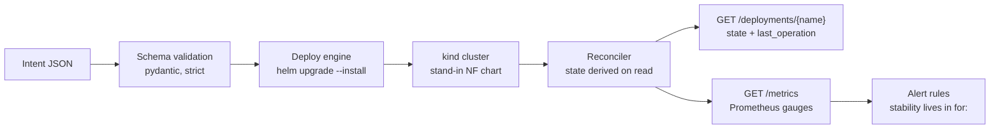

# nf-orchestrator

[](https://github.com/poggymacello/nf-orchestrator/actions/workflows/ci.yaml)

Takes a declarative intent, validates it, deploys a network function with Helm onto Kubernetes, and
reports its lifecycle state from live cluster signals — plus the failure drills that proved the
reporting wrong three times and the fixes that followed.

This is a **self-directed learning project**: a generic re-implementation, built only from public
sources, of the pattern behind SMO-driven network function orchestration in O-RAN. It runs on one
laptop against one `kind` cluster. It is not a production O-Cloud, and the deployed workload is a
generic stand-in NF, not vendor software. Full scope and non-goals in
[`docs/design/00-overview.md`](docs/design/00-overview.md).

## What it does



Every deployment reports one of four lifecycle states — `NOT_INSTANTIATED`, `INSTANTIATING`,
`INSTANTIATED`, `FAILED` — derived from Helm release status and live pod readiness on each read,
never stored. What happened to the last *operation* is reported separately, because a rejected
upgrade is not a broken network function. The model, and its grounding in ETSI SOL003 and O-RAN's
O2 interface, is in [`docs/design/lifecycle-states.md`](docs/design/lifecycle-states.md).

## Quickstart

Needs Docker, [kind](https://kind.sigs.k8s.io/), kubectl and **Helm 4**.

```bash
make install && make up
uvicorn orchestrator:app --port 8000
```

Then, in another shell — this is real output, not an illustration:

```
$ curl -s -X POST localhost:8000/deployments -H 'content-type: application/json' \
    -d '{"name":"sample-nf","replicas":2,"environment":"dev"}'
{"release":"sample-nf","status":"deployed","revision":1,
 "values":{"replicaCount":2,"environment":"dev"}}

$ curl -s localhost:8000/deployments/sample-nf          # a second later
{"release":"sample-nf","state":"INSTANTIATING","helm_status":"deployed",
 "desired_replicas":2,"ready_replicas":0,
 "last_operation":{"revision":1,"state":"COMPLETED","description":"Install complete"},
 "pods":[{"phase":"Pending","reason":"ContainerCreating","ready":false}, ...]}

$ curl -s localhost:8000/deployments/sample-nf          # once the pods are ready
{"release":"sample-nf","state":"INSTANTIATED","helm_status":"deployed",
 "desired_replicas":2,"ready_replicas":2,
 "last_operation":{"revision":1,"state":"COMPLETED","description":"Install complete"},
 "pods":[{"phase":"Running","reason":null,"ready":true},
         {"phase":"Running","reason":null,"ready":true}]}

$ curl -s localhost:8000/metrics | grep ^nf_
nf_cluster_reachable 1.0
nf_deployment_state{release="sample-nf",state="INSTANTIATED"} 1.0
nf_deployment_desired_replicas{release="sample-nf"} 2.0
nf_deployment_ready_replicas{release="sample-nf"} 2.0
nf_last_operation_state{release="sample-nf",state="COMPLETED"} 1.0

$ curl -s -X DELETE localhost:8000/deployments/sample-nf
{"release":"sample-nf","state":"NOT_INSTANTIATED","uninstalled":true}
```

`make down` deletes the cluster.

## API

| Route | Does |
|---|---|
| `POST /intents/validate` | Validate an intent without deploying it |
| `POST /intents/translate` | Free text to a *candidate* intent. Translating never deploys — the candidate goes through the same schema, and putting it in a cluster is a separate call |
| `GET /intents/schema` | The JSON Schema the intent must satisfy |
| `POST /deployments` | Deploy a validated intent. `409` if another field manager owns a field it would change — it never forces |
| `GET /deployments/{name}` | Derived lifecycle state, the replica counts behind it, and the last operation. `503` if the cluster is unreachable, never a lifecycle state |
| `POST /deployments/{name}/repair` | Apply an intent *and* take ownership of contested fields. Explicit, because it overrides whatever else was writing to them |
| `DELETE /deployments/{name}` | Uninstall the release. Idempotent |
| `GET /healthz` · `GET /readyz` | Process liveness · cluster reachability |
| `GET /metrics` | Prometheus. Reconciles every release at scrape time |

## The part worth three minutes: the failure drills

Three deliberate failure drills were run against a real cluster, each with a blameless postmortem,
fixes verified by re-running the drill, and runbooks corrected when a drill proved them wrong. Every
one found the orchestrator reporting something false.

| Drill | What it found |
|---|---|
| [1 — pods killed mid-deploy](docs/operations/postmortems/2026-08-20-drill-1-pods-killed-mid-deploy.md) | `INSTANTIATED` reported with **one pod running for a three-replica intent**. The reconciler never read how many replicas the intent asked for |
| [2 — control plane unreachable](docs/operations/postmortems/2026-08-20-drill-2-control-plane-unreachable.md) | A running NF reported as `NOT_INSTANTIATED` with **HTTP 200**, byte-identical to the response after a real teardown |
| [3 — repairing drift](docs/operations/postmortems/2026-08-26-drill-3-repairing-drift-outside-helm.md) | Repairing drift through the API failed on a server-side apply conflict, and the failed upgrade made a **still-serving workload read `FAILED`** |

Eleven findings, every defect fixed and re-verified. They turned out to be one mistake in four
places: two things that are usually equal, collapsed into a single value, diverging only during an
incident — pod phase versus container readiness, release-absent versus cluster-unreachable, intent
submitted versus intent applied, operation failed versus network function failed.

A fourth drill (node disk full) was **abandoned before running it**: kind ships `evictionHard` at
`0%`, so no amount of filling produces `DiskPressure`, and the node filesystem is the host's. The
reasoning is written down rather than the drill being run badly.

Process, severity model and runbooks: [`docs/operations/`](docs/operations/README.md).

## Engineering decisions

Recorded as ADRs with the alternatives that were rejected and why —
[`docs/design/adr/`](docs/design/adr/).

| | |
|---|---|
| [0005](docs/design/adr/0005-derive-lifecycle-state-from-cluster-signals.md) | Derive state on read, never store it |
| [0006](docs/design/adr/0006-instantiated-means-the-intent-is-satisfied.md) | `INSTANTIATED` means the intent is satisfied, and "unreachable" is not a state |
| [0007](docs/design/adr/0007-stability-is-an-alerting-concern.md) | Stability belongs in the alerting rule's `for:` window, not in the application |
| [0008](docs/design/adr/0008-forcing-field-ownership-is-an-explicit-operation.md) | The deploy path never forces conflicts; repair is a separate, named operation |
| [0009](docs/design/adr/0009-the-operation-is-not-the-network-function.md) | The operation is not the network function |

## Tests and CI

74 unit tests, plus 6 end-to-end tests that drive the real API against a real cluster. CI runs both
jobs on every branch push: `lint-test` with no cluster, and `e2e`, which creates a kind cluster and
asserts the drills' ground — a deploy reaching `INSTANTIATED`, drift showing as a shortfall, a
conflicting resubmit refused with `409`, repair taking the field back, a bad image tag reaching
`FAILED`, idempotent teardown.

Helm is pinned to 4.2.2 in CI, because the conflict behaviour those tests assert does not exist in
Helm 3 — a job on Helm 3 would pass for the wrong reason. Third-party actions are pinned to commit
SHAs.

```bash
make lint && make test      # no cluster needed
make up && make e2e         # the same command CI runs
```

## Not built

- **Gitleaks, Trivy and a banned-terms grep in CI** — M5, in progress. The leak-scrub in
  [`CONTRIBUTING.md`](CONTRIBUTING.md) is still a manual step.
- **The LLM intent layer** (text → validated JSON with guardrails) — M6. It sits *in front of* the
  schema boundary and the core loop never depends on it.
- **Any push or event stream.** State is derived per read; Prometheus scraping is a poll on a timer,
  so a transition between two scrapes is never seen.
- **Multi-cluster, HA, persistence.** One intent, one cluster, no database.

Status per milestone: [`docs/milestone-map.md`](docs/milestone-map.md).

## Documentation

| | |
|---|---|
| [Design](docs/design/) | Problem statement, architecture, the lifecycle state model, and 8 ADRs |
| [Operations](docs/operations/README.md) | Failure drills, postmortems, runbooks, alerting |
| [Build log](docs/build-log/) | Per-milestone: what was set out to do, what broke, what was learned |
| [Daily log](docs/daily-log/) | A dated record of every working day on this project |
| [Learning notes](docs/learning-notes/) | FastAPI, JSON Schema, Helm/kind, Prometheus |

## License

[MIT](LICENSE).
