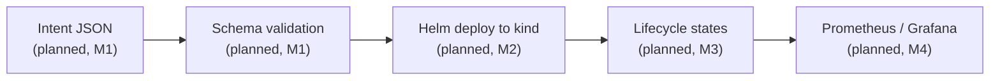

# Architecture

One path, five stages. An intent goes in one end; a deployed, observable workload exists at the
other.

Nothing in this diagram is wired into the running application yet. M0 delivered a FastAPI skeleton
with only a `/healthz` endpoint — none of these five stages exist as code today. Each has been
exercised manually to learn the mechanics ahead of building it; see the notes linked below.

## What each box maps to

**Intent JSON** — the caller's declarative request: what to deploy and with what parameters. Will
live as a request body on a FastAPI endpoint in `orchestrator/`. Not yet defined in code.

**Schema validation** — rejects a malformed intent before it can reach a cluster. A pydantic model
was prototyped standalone in `scripts/intent_validate.py` (see
[`docs/learning-notes/json-schema-validation.md`](../learning-notes/json-schema-validation.md)),
run outside the app to observe real accept/reject behavior. The real model will live in
`orchestrator/` once M1 wires it into an endpoint.

**Helm deploy to kind** — takes a validated intent, renders it into Helm values, and installs or
upgrades a release against the local `kind` cluster (`kind-config.yaml` at repo root). Exercised
by hand with a scratch chart, not the real stand-in NF chart, which does not exist yet; see
[`docs/learning-notes/helm-and-kind.md`](../learning-notes/helm-and-kind.md). The actual
intent-to-values mapping is M2.

**Lifecycle states** — collapses raw Kubernetes pod phases and Helm release status into
`NOT_INSTANTIATED` / `INSTANTIATING` / `INSTANTIATED` / `FAILED`. Design and the real state
transitions observed against a manual deploy are recorded in
[`docs/design/lifecycle-states.md`](lifecycle-states.md). The reconciler that watches the cluster
and reports these states is M3 and does not exist yet.

**Prometheus / Grafana** — deployment counters and time-to-instantiate, exposed by the orchestrator
and visualized in Grafana. Not started; this is M4, bundled with the deliberate failure drills and
the runbooks/postmortems they produce.

## Milestone status

| Stage | Milestone | Status |
|---|---|---|
| FastAPI skeleton, `/healthz`, CI (lint+test) | M0 | done |
| Intent JSON + schema validation endpoint | M1 | planned |
| Helm deploy engine | M2 | planned |
| Status reconciler + lifecycle states | M3 | planned |
| Observability + failure drills | M4 | planned |
| CI hardening (Gitleaks, Trivy, e2e) | M5 | planned |
| LLM intent layer | M6 | planned |
