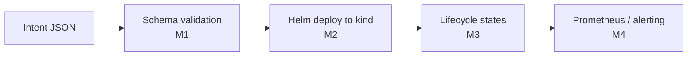

# Architecture

One path, five stages. An intent goes in one end; a deployed, observable workload exists at the
other.

All five stages are wired into the running application as of M4. Each box below says what it is,
where the code lives, and what it does not do.

## What each box maps to

**Intent JSON** — the caller's declarative request: a name, a replica count, an environment. It
arrives as the request body of `POST /deployments` or `POST /intents/validate`.

**Schema validation** — rejects a malformed intent before it can reach a cluster. `Intent` in
[`orchestrator/intent.py`](../../orchestrator/intent.py) is a pydantic model in strict mode with
`extra="forbid"`: a name matching the Kubernetes name pattern, `replicas` between 1 and 10, and
`environment` one of `dev` / `staging` / `prod`. Anything else is a `422` before any cluster call
happens, which is why the deploy counter counts validated attempts rather than HTTP requests. The
contract is [ADR-0003](adr/0003-intent-schema-contract.md); `GET /intents/schema` serves the schema
the model generates.

**Helm deploy to kind** — renders the validated intent into Helm values and runs
`helm upgrade --install` against the local `kind` cluster.
[`orchestrator/deploy.py`](../../orchestrator/deploy.py) shells out to the `helm` binary rather than
using a Go client, for the reasons in [ADR-0004](adr/0004-helm-as-the-deploy-mechanism.md). The
chart is [`charts/stand-in-nf`](../../charts/stand-in-nf), a generic nginx workload standing in for a
network function.

Helm 4 applies server-side, so a field another manager owns is refused rather than silently
overwritten. The deploy path never passes `--force-conflicts`; that refusal surfaces as `409`, and
taking ownership is a separate named operation, `POST /deployments/{name}/repair`
([ADR-0008](adr/0008-forcing-field-ownership-is-an-explicit-operation.md)).

**Lifecycle states** — collapses Helm release status and live pod readiness into
`NOT_INSTANTIATED` / `INSTANTIATING` / `INSTANTIATED` / `FAILED`.
[`orchestrator/reconciler.py`](../../orchestrator/reconciler.py) derives the state on every read
rather than storing it ([ADR-0005](adr/0005-derive-lifecycle-state-from-cluster-signals.md)), and
`INSTANTIATED` requires the replica count the intent asked for to actually be ready
([ADR-0006](adr/0006-instantiated-means-the-intent-is-satisfied.md)). What happened to the last
*operation* is reported separately, because a rejected upgrade is not a broken network function
([ADR-0009](adr/0009-the-operation-is-not-the-network-function.md)). The state model and its ETSI
SOL003 grounding are in [`lifecycle-states.md`](lifecycle-states.md).

An unreachable cluster is not a lifecycle state: the reconciler raises and the endpoint returns
`503` rather than reporting a deployment that it cannot see.

**Prometheus / alerting** — [`orchestrator/metrics.py`](../../orchestrator/metrics.py) exposes
`/metrics`. `deployments_total` and `deployment_repairs_total` are counters the application
increments; `nf_deployment_state`, the replica gauges, `nf_last_operation_state` and
`nf_cluster_reachable` come from a collector that reconciles every release **at scrape time**, which
makes Prometheus the poller and closes ADR-0005's gap about transitions nobody polled for.

Stability is not defined here. The state is instantaneous and honest about it; how long a condition
must hold before it pages is set per rule by `for:` in
[`monitoring/nf-lifecycle.rules.yml`](../../monitoring/nf-lifecycle.rules.yml)
([ADR-0007](adr/0007-stability-is-an-alerting-concern.md)).

## What is not in this diagram

- **The LLM intent layer** (M6, planned) sits in front of the first box. It only ever produces a JSON
  document that goes through the same validation as any other intent; the core path never depends on
  it.
- **Persistence.** There is no database. Helm's release history is the only record that an intent was
  ever submitted.
- **A background controller.** Nothing watches the cluster continuously. Reads reconcile on demand,
  and the Prometheus scrape interval is the only timer.
