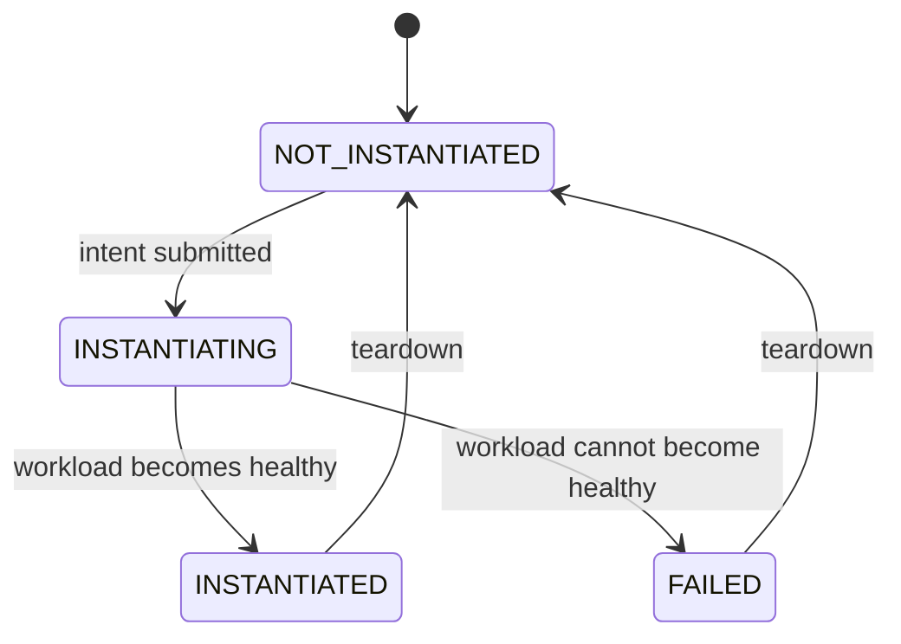

# NF lifecycle states

The orchestrator models every deployment as one of four states:
`NOT_INSTANTIATED → INSTANTIATING → INSTANTIATED → FAILED`. As of M3 the reconciler emits these
states, deriving each from live Kubernetes and Helm signals at read time. This document reconciles
the model against what a real deploy, failure, and teardown actually produce.

## State diagram

## Transition table

Signals in the last column are what the reconciler read to derive each transition, observed on
2026-07-23 unless noted.

| Transition | Trigger | Underlying signal the reconciler derived from | Status |
|---|---|---|---|
| `NOT_INSTANTIATED` → `INSTANTIATING` | Intent submitted, deploy engine calls `helm upgrade --install` | Helm release status is `deployed` and pods are not all `Running` yet. Observed: `helm=deployed pods=[('Pending','ContainerCreating'),('Pending','ContainerCreating')]` at 08:11:43 | emitted by the reconciler (M3) |
| `INSTANTIATING` → `INSTANTIATED` | The intent is satisfied: as many ready pods as the intent asked for | Pod count equals the release's `replicaCount` and every pod's containers report `ready`. Observed on 2026-08-21 after the M4 fixes: `desired=3 ready=3 pods_counted=3`. Until M4 this was "all pod phases are `Running`", which reported `INSTANTIATED` for one pod of a three-replica intent — see [ADR-0006](adr/0006-instantiated-means-the-intent-is-satisfied.md) | emitted by the reconciler (M3, revised M4) |
| `INSTANTIATING` → `FAILED` | A pod cannot become healthy, or stopped and was not replaced | Any pod waiting-reason in `ImagePullBackOff` / `ErrImagePull` / `CrashLoopBackOff`, or any non-terminating pod in phase `Succeeded` / `Failed`. Observed by upgrading to a nonexistent image tag: `helm=deployed pods=[('Pending','ErrImagePull'),('Running',None),('Running',None)]` at 08:14:16, settling to `ImagePullBackOff`. `helm status` stayed `deployed` the whole time, so the state came from the pod signal, not the release | emitted by the reconciler (M3, revised M4) |
| `INSTANTIATED` / `FAILED` → `NOT_INSTANTIATED` | Teardown | `DELETE /deployments/{name}` runs `helm uninstall`; the next read finds no release. Observed: `{"state":"NOT_INSTANTIATED","uninstalled":true}`, then `helm list` shows the release gone and no pods remain | emitted by the reconciler (M3) |

## What exists today vs planned

As of M3 the orchestrator emits all four states itself. `GET /deployments/{name}` reads the live
Helm release status and pod phases and returns the derived state; `DELETE /deployments/{name}`
uninstalls the release and returns `NOT_INSTANTIATED`. The derivation is a pure function,
`derive_state`, described in [ADR-0005](adr/0005-derive-lifecycle-state-from-cluster-signals.md) and
the [M3 build log](../build-log/m3-reconciler.md). State is derived on read, not stored.

Since M4 the response also carries `desired_replicas` and `ready_replicas`, so the numbers the
state depends on are visible next to it.

**There is no state for "I cannot see the cluster".** If the control plane is unreachable, the
reconciler raises rather than answering, and the endpoint returns `503`. This matters because the
four states are claims about the NF, and an outage is not one: reporting `NOT_INSTANTIATED` in that
situation — which is what the reconciler did until 2026-08-21 — announces a teardown that never
happened. `/healthz` is process liveness only; `/readyz` reports whether the cluster can be
reached. See [ADR-0006](adr/0006-instantiated-means-the-intent-is-satisfied.md) and the
[drill-2 postmortem](../operations/postmortems/2026-08-20-drill-2-control-plane-unreachable.md).

Still `(planned)`: any push/event stream for these transitions. The reconciler polls on request and
cannot report a transition nobody polled for. State also still flaps across reads during a normal
rollout, honestly now — deciding what a *stable* state means is open.

## Why these states exist

This four-state model is a simplified version of two things ETSI NFV and O-RAN already define
publicly, not an invented scheme.

ETSI NFV's VNF Lifecycle Management interface (SOL003) defines an `instantiationState` attribute
with exactly two values, `NOT_INSTANTIATED` and `INSTANTIATED`, plus a separate
`LcmOperationStateType` for in-flight operations: `STARTING`, `PROCESSING`, `COMPLETED`,
`FAILED_TEMP`, `FAILED`, `ROLLING_BACK`, `ROLLED_BACK`
([ETSI GS NFV-SOL 003 V3.5.1](https://www.etsi.org/deliver/etsi_gs/NFV-SOL/001_099/003/03.05.01_60/gs_NFV-SOL003v030501p.pdf)).
This project's `INSTANTIATING` collapses `STARTING`/`PROCESSING` into one state, and `FAILED`
maps directly onto the SOL003 `FAILED` operation state.

O-RAN's O2 interface (Working Group 6, Cloudification and Orchestration) manages NF Deployments
by aligning its lifecycle, fault, and performance services to these same ETSI NFV SOL APIs
([O-RAN Alliance specifications](https://www.o-ran.org/specifications)). A real SMO-driven
orchestrator reports deployment state this way so that anything watching it — a dashboard, an
alarm system, a rollback controller — has a single small enum to react to instead of parsing raw
Kubernetes pod phases or Helm release output directly.

## Reference: raw signals vs the four states

The four states are a projection over lower-level signals, not a replacement for them:

- **Kubernetes pod phase**: `Pending`, `ContainerCreating`, `Running`, `CrashLoopBackOff`,
  `ErrImagePull`, `ImagePullBackOff`, `Terminating` — observed directly via `kubectl get pods`.
- **Helm release status**: `deployed`, `failed`, `uninstalled` — observed via `helm status`. As
  seen above, `deployed` does not imply the workload is healthy; it only means the manifest was
  applied successfully.

The reconciler's job is to read the first two and report one of the four states — not to invent new
information, but to compress two APIs' worth of raw signals into one.
