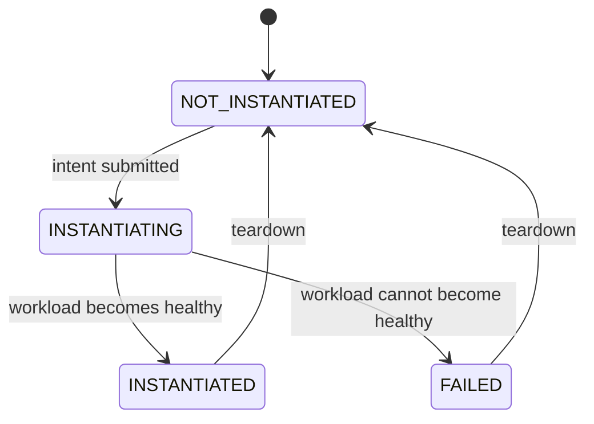

# NF lifecycle states

The orchestrator models every deployment as one of four states:
`NOT_INSTANTIATED → INSTANTIATING → INSTANTIATED → FAILED`. This document reconciles that model
against what a real Helm-onto-Kubernetes deploy actually does.

## State diagram

## Transition table

| Transition | Trigger | Underlying signal (observed 2026-07-17) | Status |
|---|---|---|---|
| `NOT_INSTANTIATED` → `INSTANTIATING` | Intent submitted, deploy engine calls `helm install` | `helm install` returns `STATUS: deployed`, `REVISION: 1`; pod appears as `Pending` then `ContainerCreating` | code today: nothing calls this; `(planned, M3)` for the reconciler to report it |
| `INSTANTIATING` → `INSTANTIATED` | Workload reaches a healthy state | `kubectl get pods` shows `1/1 Running` — observed sequence: `Pending` → `ContainerCreating` → `Running` | `(planned, M3)` |
| `INSTANTIATING` → `FAILED` | Workload cannot become healthy | `kubectl get pods` shows `ErrImagePull` → `ImagePullBackOff`, persisting — observed by deploying a nonexistent image tag. `helm status` stayed `STATUS: deployed` the entire time; release status and pod health are separate signals, only the second one tells you the workload actually failed | `(planned, M3)` |
| `INSTANTIATED` / `FAILED` → `NOT_INSTANTIATED` | Teardown | `helm uninstall` returns `release uninstalled`; pod goes `Terminating` then disappears | `(planned, M3)` |

## What exists today vs planned

Everything above the table is real, observed Kubernetes/Helm behavior from a manual deploy of a
scratch chart. None of it is currently reported by the orchestrator itself — there is no status
reconciler yet. The `orchestrator/` code at this milestone (M0) only serves `/healthz`; it does not
watch pods, does not call Helm, and does not expose any of these four states. The reconciler that
would poll Kubernetes and translate pod/release signals into `NOT_INSTANTIATED` /
`INSTANTIATING` / `INSTANTIATED` / `FAILED` is `(planned, M3)`.

## Why these states exist

This four-state model is a simplified version of two things ETSI NFV and O-RAN already define
publicly, not an invented scheme.

ETSI NFV's VNF Lifecycle Management interface (SOL003) defines an `instantiationState` attribute
with exactly two values, `NOT_INSTANTIATED` and `INSTANTIATED`, plus a separate
`LcmOperationStateType` for in-flight operations: `STARTING`, `PROCESSING`, `COMPLETED`,
`FAILED_TEMP`, `FAILED`, `ROLLING_BACK`, `ROLLED_BACK`
([ETSI GS NFV-SOL 003 V3.5.1](https://www.etsi.org/deliver/etsi_gs/NFV-SOL/001_099/003/03.05.01_60/gs_NFV-SOL003v030501p.pdf)).
This project's `INSTANTIATING` collapses `STARTING`/`PROCESSING` into one state, and `FAILED`
maps directly onto the SOL003 `FAILED` operation state.

O-RAN's O2 interface (Working Group 6, Cloudification and Orchestration) manages NF Deployments
by aligning its lifecycle, fault, and performance services to these same ETSI NFV SOL APIs
([O-RAN Alliance specifications](https://www.o-ran.org/specifications)). A real SMO-driven
orchestrator reports deployment state this way so that anything watching it — a dashboard, an
alarm system, a rollback controller — has a single small enum to react to instead of parsing raw
Kubernetes pod phases or Helm release output directly.

## Reference: raw signals vs the four states

The four states are a projection over lower-level signals, not a replacement for them:

- **Kubernetes pod phase**: `Pending`, `ContainerCreating`, `Running`, `CrashLoopBackOff`,
  `ErrImagePull`, `ImagePullBackOff`, `Terminating` — observed directly via `kubectl get pods`.
- **Helm release status**: `deployed`, `failed`, `uninstalled` — observed via `helm status`. As
  seen above, `deployed` does not imply the workload is healthy; it only means the manifest was
  applied successfully.

The reconciler's job, once built, is to watch the first two and report one of the four states —
not to invent new information, but to compress two APIs' worth of raw signals into one.
