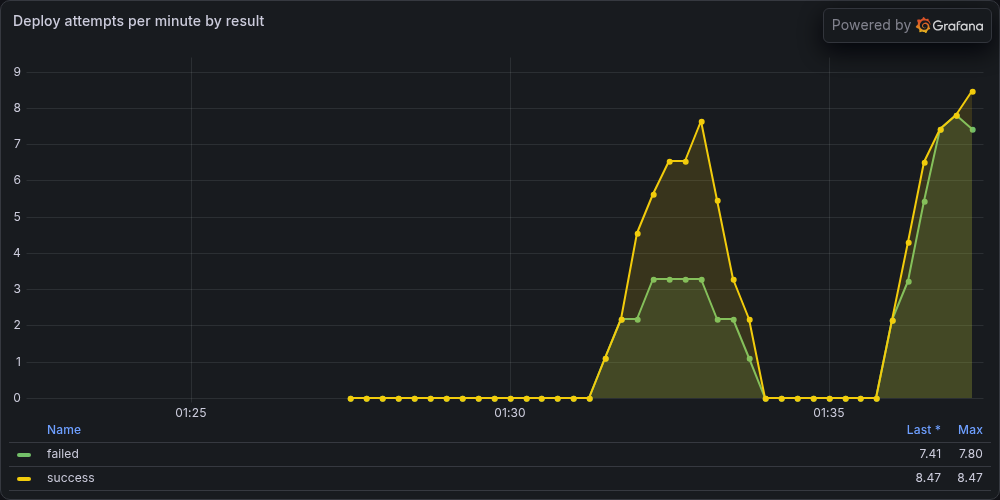

# Prometheus instrumentation

How one real metric gets from a line of Python in the orchestrator to a Grafana panel, and what the
plumbing actually requires.

## Mental model

Three pieces, each doing one thing:

`prometheus_client` keeps counters in memory in the application process and renders them as a plain
text page at `/metrics`. Prometheus pulls that page on an interval and stores each sample against a
timestamp; the application never pushes anything and does not know Prometheus exists. Grafana holds
no data at all, it queries Prometheus with PromQL and draws the answer.

The consequence worth internalising: the application only ever exposes a current value. Anything
about change over time (a rate, a trend, a spike) is computed later by Prometheus from a series of
scrapes.

## The metric

`deployments_total`, a **Counter**, labelled `result` (`success` / `failed`) and `environment`
(`dev` / `staging` / `prod`).

Defined in [`orchestrator/metrics.py`](../../orchestrator/metrics.py) against a module-level
`CollectorRegistry`, and incremented in `create_deployment` in
[`orchestrator/__init__.py`](../../orchestrator/__init__.py): `record_deploy("success", ...)` after
the deploy engine returns, `record_deploy("failed", ...)` in the `DeployError` handler before the
`502` is raised. A Counter is the right type because deploy attempts only accumulate; a Gauge would
imply the value can fall, and a falling deploy count means nothing.

Labels were chosen for bounded cardinality. `environment` has three possible values, fixed by the
M1 schema. Labelling by intent `name` was the tempting alternative and would create a new time
series per network function deployed, which is how a metrics backend gets buried.

## The metric moving on real events

Before any deploy, a fresh process:

```
$ curl -s localhost:8000/metrics | grep deployments_total
# HELP deployments_total Intents submitted to the deploy engine, by outcome
# TYPE deployments_total counter
```

Then one real success through the M2 engine, and one real failure. The failure was produced by
creating a `Deployment` outside Helm and then submitting an intent of the same name, so Helm
refused to adopt it:

```
$ curl -s -X POST localhost:8000/deployments -H 'content-type: application/json' \
    -d '{"name":"sample-nf","replicas":2,"environment":"dev"}'
{"release":"sample-nf","status":"deployed","revision":1,"values":{"replicaCount":2,"environment":"dev"}}

$ curl -s -X POST localhost:8000/deployments -H 'content-type: application/json' \
    -d '{"name":"orphan-nf","replicas":1,"environment":"staging"}'
{"detail":"Error: unable to continue with install: Deployment \"orphan-nf\" in namespace \"default\"
exists and cannot be imported into the current release: invalid ownership metadata; label validation
error: missing key \"app.kubernetes.io/managed-by\": must be set to \"Helm\" ..."}
```

After:

```
$ curl -s localhost:8000/metrics | grep ^deployments_total
deployments_total{environment="dev",result="success"} 1.0
deployments_total{environment="staging",result="failed"} 1.0
```

Both label sets appeared on first use and carry the real outcomes.

## Scrape config

Prometheus in a container, the orchestrator on the host:

```yaml
global:
  scrape_interval: 5s

scrape_configs:
  - job_name: nf-orchestrator
    static_configs:
      - targets: ["host.docker.internal:8000"]
```

Target health, from the Prometheus API rather than the Targets page, since it is the same data:

```
$ curl -s "localhost:9090/api/v1/targets?state=active"
job=nf-orchestrator  target=http://host.docker.internal:8000/metrics  health=up  lastError=''
```

## The panel

One panel, `Deploy attempts per minute by result`:

```promql
sum by (result) (rate(deployments_total[1m])) * 60
```

`rate` over the raw counter gives per-second change; `* 60` reads as attempts per minute, and
`sum by (result)` collapses the `environment` label so the panel answers one question. Checked
against Prometheus directly before trusting the graph:

```
$ curl -s -G localhost:9090/api/v1/query --data-urlencode \
    'query=sum by (result) (rate(deployments_total[1m])) * 60'
result=success  value=2.18
result=failed   value=1.09
```



Two bursts of real deploy traffic, successes above failures, both returning to zero between bursts.

## The gotcha: a labelled counter has no series until it is used

The `BEFORE` scrape above is the whole lesson. A fresh process served `# HELP` and `# TYPE` for
`deployments_total` and nothing else, because `prometheus_client` creates a child series the first
time a label combination is used, not when the metric is declared. Prometheus scraped that page
happily and stored no samples, so the panel showed `No data` rather than a flat line at zero.

That difference matters for anything built on top. An alert like "success rate dropped below X"
does not fire on a freshly restarted process with no deploys, because there is no series to
evaluate, not because everything is fine. Calling `.labels(...)` for known combinations at startup
is the usual fix; it is not done here, and the panel legend genuinely shows `No data` until the
first deploy of each kind.

A second, smaller one. An intent that fails M1 validation never reaches the counter:

```
$ curl -s -o /dev/null -w '%{http_code}\n' -X POST localhost:8000/deployments \
    -H 'content-type: application/json' \
    -d '{"name":"sample-nf","replicas":2,"environment":"production"}'
422
```

Series count before and after: 3 and 3. FastAPI rejects the body before the handler runs, so
`deployments_total` counts deploy attempts that passed validation, not HTTP requests to
`/deployments`. That is the intended meaning, but the name does not say so on its own.

## What is not here

- **The three failure drills and their postmortems.** Run on Day 11 to Day 13 and written up in
  [operations/](../operations/README.md). Nothing in this note is a drill; the failure counted above
  is a Helm ownership conflict produced to move the metric, not an incident.
- **Prometheus and Grafana in CI.** `lint-test` runs `ruff` and `pytest` only. The counter is unit
  tested against the `prometheus_client` registry with the Helm call monkeypatched; no live
  Prometheus is involved. Running the stack against kind is `(planned, M5)`.
- **A histogram of instantiate time.** Still not measured.
- **A persisted Grafana dashboard.** The panel above is provisioned from a JSON file for the length
  of the exercise; the monitoring stack was torn down afterwards and the kind cluster left running.

## What came after this note

Day 13 added a second kind of metric with a different shape, described in
[ADR-0007](../design/adr/0007-stability-is-an-alerting-concern.md). `deployments_total` is a counter
the application increments as things happen. `nf_deployment_state` and its companions are gauges
produced by a **custom collector** that runs at scrape time: `LifecycleCollector` reconciles every
Helm release when Prometheus asks, rather than caching a value the application updated earlier.

That inverts the mental model at the top of this note in one specific way. The application still
never pushes, but it is no longer only reporting a value it already had — the scrape itself is what
causes the work to happen. It is the pattern every exporter uses, and it is what turned "the
reconciler cannot report a transition nobody polled for" into "Prometheus is the thing polling".

The gotcha below still applies, and applies harder to gauges emitted conditionally: during a cluster
outage the collector emits `nf_cluster_reachable 0` and **no** `nf_deployment_state` series at all,
so those series go stale rather than to zero. A panel over them shows a gap, which is why
`nf_cluster_reachable` belongs next to any such panel.

## Sources

- prometheus_client, <https://prometheus.github.io/client_python/>
- Metric types, <https://prometheus.io/docs/concepts/metric_types/>
- `rate()` and counters, <https://prometheus.io/docs/prometheus/latest/querying/functions/#rate>
- Grafana Prometheus data source, <https://grafana.com/docs/grafana/latest/datasources/prometheus/>
